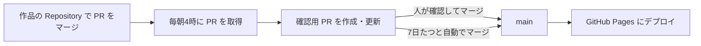

サーバーもデータベースも持たずに、開発を続けるほど勝手に中身が育っていくポートフォリオ（[tora29.net](https://tora29.net)）を作りました。GitHub で PR をマージすると、その内容が開発活動（Activity）としてサイトに載ります。この記事では、職歴や作品を並べるだけのポートフォリオとはちょっと違う、仕組みの部分を中心に紹介します。ソースコードは [GitHub](https://github.com/Tora29/my-portfolio) で公開しているので、気になる方はどうぞ。

## 何を作りたかったか

ポートフォリオがほしい、、！が、ありきたりなものはつまらんなぁ、、と思った今日この頃。

ポートフォリオは、作った時点の自分しか表さないことが多いです。職歴や作品を並べても、その後の開発や学習が反映されなければ、すぐに古くなってしまいます。しかも自分の性格上、絶対に更新をサボると思いました。

そこで、日々の開発・技術発信・経歴を一か所に集め、**開発を続けること自体がサイトの更新になる**ようにしました。

サイトは Astro で作り、すべてをビルド時に生成して GitHub Pages で配信しています。記事・作品・職歴は Markdown と YAML で管理し、Git を唯一の正にしています。

## 全体の流れ

ざっくり、こんな流れです。



毎朝4時（日本時間）に、GitHub Actions が作品に紐付く Repository のマージ済み PR と Release を取得します。取得した内容から、Activity のデータ（`activity.json`）を生成します。生成結果はすぐには公開せず、確認用の PR（`bot/activity` ブランチ）にまとめます。私がこの PR をマージするか、作成から7日たって自動でマージされると、サイトがデプロイされます。

つまり Activity については、私がやるのは PR を書いてマージするだけです。確認すら、サボっても7日で公開されます。

## PR を書くことがサイトの更新になる

Activity の見出しは PR のタイトル、要約は PR 本文の最初の段落です。タイトルは Conventional Commits の形式（`feat(tech): Tech をジャンル別に表示`）で書きます。見出しになるのは、`: ` より後ろの部分です。

要約は LLM で生成せず、本文の最初の段落を正規表現で抜き出しています。自分が書いた文がそのまま公開されるので、PR は閲覧者が読む前提で書くことにしました。雑な PR を書くと、それがそのまま世に出るわけです、、。最初の段落がそのまま公開されることは、PR テンプレートの冒頭にも書いています。

```markdown:.github/pull_request_template.md
<!--
最初の段落は Activity の要約として、ポートフォリオにそのまま公開される（.claude/rules/git-workflow.md）。
何を変えて、閲覧者にとって何が良くなったかを1〜2文で書く。実装の詳細は見出し以降に書く。
下の定型文のままにすると、PR タイトルが要約に使われる。
-->

（ここに要約を書く）

## 変更内容
```

抜き出す処理では、テンプレートの説明（HTML コメント）と見出し以降を除き、箇条書きや表ではない最初の段落を選びます。

```ts:scripts/activity/summary.ts
export function extractSummary(body: string | null, fallback: string): string {
  if (!body) return fallback;

  // 1.
  const text = body.replace(/<!--[\s\S]*?-->/g, '').replace(/\r\n/g, '\n');

  // 2. コードブロックの中の # を見出しと誤認しないよう、先にコードブロックを除く
  const withoutCode = text.replace(/```[\s\S]*?```/g, '\n\n');
  const beforeHeading = withoutCode.split(/^#{1,6}\s/m)[0];

  // 3.
  const isNotProse = /^\s*([-*+]\s|\d+[.)]\s|>|\||\[[ xX]\])/;
  const paragraph = beforeHeading
    .split(/\n\s*\n/)
    .map((p) => p.trim())
    .find((p) => p !== '' && !isNotProse.test(p));
  const plain = paragraph ? toPlainText(paragraph) : '';

  // 4.
  if (plain === '' || plain === TEMPLATE_PLACEHOLDER) return fallback;
  return truncate(plain);
}
```

依存関係の更新や CI の調整など、閲覧者にとって意味の薄い変更は、タイトルの接頭辞で除外します。`chore:` の PR がずらっと並んでも、見る側は困りますからね。Bot が作った PR と、`activity:skip` ラベルを付けた PR も載せません。

```ts:scripts/activity/classify.ts
const TYPES: Record<string, ActivityType | null> = {
  feat: 'feature',
  fix: 'fix',
  perf: 'improvement',
  refactor: 'improvement',
  docs: 'docs',
  // 雑務は除外する
  chore: null,
  ci: null,
  build: null,
  test: null,
  style: null,
};
```

## 自動で公開しつつ、人が確認できる

PR から自動で作った Activity をそのまま公開すると、意図しない内容が載ることがあります。かといって、確認しないと公開されない作りにすると、確認を忘れた時点で更新が止まります。そして私は確実に忘れます。そこで、確認用 PR を挟みつつ、放っておいても7日たてば公開されるようにしました。

確認用 PR の本文には、まだ公開していない Activity の見出し・要約・Tech が一覧で載ります。この PR の上で、次のことができます。

- 要約を直す：確認用ブランチの `activity.json` を編集する
- 載せない：除外リスト（`activity-excluded.yml`）に id と理由を書く
- 公開を止める：PR に `hold` ラベルを付ける

7日の期限は、PR の作成日時から数えます。確認用 PR は毎日上書きされるので、最終更新日時から数えると、いつまで待っても公開されないポートフォリオの完成です。

```bash:.github/workflows/activity.yml
if jq -e '.labels | any(.name == "hold")' <<< "$pr" > /dev/null; then
  echo "#$number は hold のため公開しません"
  exit 0
fi
age=$(( ($(date +%s) - $(date -d "$(jq -r .createdAt <<< "$pr")" +%s)) / 86400 ))
if [ "$age" -lt "$REVIEW_DAYS" ]; then
  echo "#$number は作成から ${age} 日（${REVIEW_DAYS} 日で公開）"
  exit 0
fi
gh pr merge "$number" --repo "$REPO" --squash --delete-branch
```

### 人が直した内容を消さない

確認用ブランチは毎朝 main から作り直すので、せっかく人が直した内容が、翌日の生成で元に戻らないようにしています。

- すでに `activity.json` にある id は生成し直さず、既存の内容を残す
- 作り直したブランチに、確認用ブランチの上で直された `activity.json` と除外リストだけを持ち込む
- push には `--force-with-lease` を使う。取得したあとに人が確認用ブランチを編集していたら、上書きせずに失敗させ、翌日の実行で取り込む

```ts:scripts/activity/merge.ts
const known = new Set(existing.map((a) => a.id));
const added = generated.filter((a) => !known.has(a.id) && !excluded.has(a.id));

// 除外リストに後から追加された id は、既存の activity.json に残っていても載せない
const kept = existing.filter((a) => !excluded.has(a.id));
```

地味な落とし穴として、GitHub Actions の `GITHUB_TOKEN` で作った push や PR では、ほかのワークフローが起動しません。そのため、フォーマットの確認とビルドは確認用 PR を作るワークフローの中で行い、通ったものだけを push しています。自動マージのあとのデプロイも、同じワークフローの中からデプロイ用のワークフローを呼び出して行っています。

### 載せる範囲を2段で絞る

公開 Repository の PR でも、全部を載せたいわけではありません。そこで、載せる範囲を2段で絞っています。

1. 集めるのは、作品の frontmatter に `github: { owner, repo }` を書いた Repository だけにする
2. その中から、接頭辞・Bot・ラベル・除外リストで外す

除外リストには、外した理由も残します。実際に、私生活に関わる内容を含む PR を除外リストで外しています。（ポートフォリオで生活感まで出すわけにはいかないので、、笑）

## 実績から技術を逆引きする（Engineering Graph）

作品・記事・職歴・Activity には、使った技術（Tech）を付けています。ビルド時にこれを逆引きし、技術ごとに「どの作品で使い、どんな記事を書き、どの職歴で経験したか」をまとめています。熟練度を自己申告で書く代わりに、実績から辿れるようにするのが狙いです。「TypeScript ★★★★☆」みたいな自己申告は、自分で書くとつい盛ってしまいそうなので！

Activity の Tech は、PR に `tech:<id>` ラベルがあればそれを使い、なければ作品の Tech を引き継ぎます。

### 表記ゆれをビルドエラーにする

同じ技術が「TypeScript」と「TS」のように別の書き方をされると、別の技術として集計されてしまいます。しかも見た目では気づきにくい。そこで、Tech は `data/tech.yml` の一か所で定義し、コンテンツからは id で参照するようにしました。Astro の Content Collections の `reference` を使うと、定義にない id を書いたときにビルドが失敗します。

```ts:src/content.config.ts
/**
 * Tech の参照。data/tech.yml の id だけを受け付ける。
 * 表示名（TypeScript）や別名（TS）で書くとビルドエラーになるため、表記ゆれが起きない
 */
const techRefs = z.array(reference('tech'));

/** Tech の一覧（data/tech.yml）。すべてのコンテンツが参照する Tech の唯一の定義元 */
const tech = defineCollection({
  loader: orderedYaml('data/tech.yml'),
  schema: z.object({
    name: z.string(),
    order: z.number(),
    // 未定義のジャンルはビルドエラー
    category: reference('techCategories'),
    // 上位 Tech（例：Azure OpenAI Service → Azure）。循環参照は Engineering Graph の生成時に検出する
    parent: reference('tech').optional(),
  }),
});
```

`techRefs` は作品・記事・職歴・Activity のスキーマで共通して使っています。上位の技術（`parent`）の循環は、`reference` では検出できません。そのため、集計の前に上位の技術を辿って検出し、ビルドを止めています。

### 上位の技術に実績をまとめる

技術には上位・下位の関係（例：Azure と Azure OpenAI Service）を持たせ、下位の技術の実績を上位にも数えます。また、同じコンテンツで一緒に使われた技術を「関連する技術」として表示します。

```ts:src/lib/graph/build-graph.ts
// 3. 自身と下位 Tech の実績をまとめる。
//    上位と下位の両方が付いたコンテンツ（例：AWS と Lambda）を2件と数えないよう、重複を除く
const total = emptyIds();
for (const kind of CONTENT_KINDS) {
  const ids = [t.id, ...descendants].flatMap((id) => direct.get(id)![kind]);
  total[kind] = [...new Set(ids)];
}

// 4. 関連 Tech。下位 Tech の実績も含めたコンテンツで、一緒に使われた Tech を数える。
//    自身・上位・下位は除く（例：AWS の関連に Lambda が常に出るのは情報にならないため）
const excluded = new Set([t.id, ...ancestors, ...descendants]);
const counts = new Map<string, number>();
for (const kind of CONTENT_KINDS) {
  for (const id of total[kind]) {
    for (const other of techOfContent.get(contentKey({ kind, id })) ?? []) {
      if (!excluded.has(other)) counts.set(other, (counts.get(other) ?? 0) + 1);
    }
  }
}
```

実績が1件もない技術は、一覧に出さず、詳細ページも作りません。サイトに載っている技術には、すべて辿れる実績があります。書いただけの技術は載りません。

## 静的サイトで「今」を見せる

Home の右下には最新の Activity を表示しています。更新から7日以内なら緑の点が脈動し、30日を過ぎると灰色の点と「Last update」の表示に変わります。

ただ、静的サイトのページはビルドした日の状態で生成されます。ビルド時に判定すると、しばらく更新していなくても緑の点が脈動し続ける、という悲しいことになります。そこで、この判定はブラウザで閲覧した日を基準にやり直しています。ビルド時の判定は、JavaScript が無効なときの表示にだけ使います。

Home の惑星を回る衛星の数も、各セクションの件数（作品数、記事数など）に連動しています。中身が増えるほど、惑星の周りがにぎやかになります。

## これから

記事の充実に取り組んでいきます。

課題もあります。実績から技術を辿れるようにした分、「具体的に何をどれだけできるか」は逆に伝わりにくくなっています。ここはこれから考えたいところです。

サイト自体の開発も Activity として載るので、このサイトの変化がそのまま開発の記録になります。サボり癖のある自分でも、開発さえ続けていれば勝手に育つ、、はずです！
