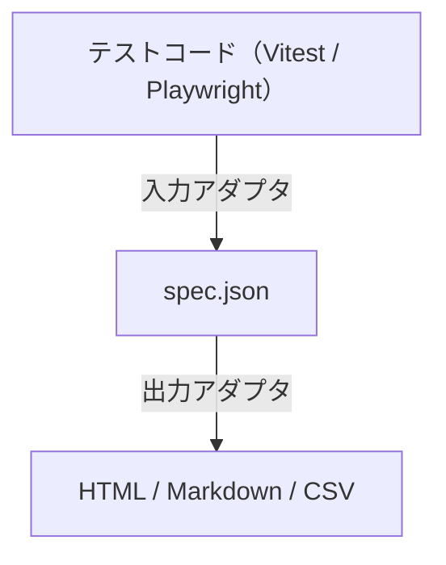

ワイ「ほなこの仕様から導けるテストコード書いてクレメンス。」
AI 「できたで！（すごい量のテストコード）」
ワイ「、、アウトプット多すぎィ！！」

という感じで AI にテストを書かせると、その大量のアウトプットを前にレビューが追いつかなくなります。

特に AI 駆動開発では、TDD（テスト駆動開発）で進める機会も多いと思います。仕様から先にテストを書かせ、そのテストを満たすように実装させる進め方です。この場合、実装を書かせる前に、テストが仕様どおりになっているかを人間が確かめておく必要があります。

そこで、テストのレビューを少しでも楽にするために、テストを人間が読みやすい形に整えて出力するツールを作りました。

**testglass** は、テストコードを静的解析して、人間がレビューするための「テスト仕様書」を生成します。出力できる形式は次の3つです。

- **HTML**：ブラウザで開いて、人が読みやすい表の形で確かめられる
- **Markdown**：GitHub 上でも表が崩れないので、リポジトリに置いてそのまま読める
- **CSV**：表計算ソフトで開いて、絞り込みや並べ替えができる

npm で公開していて、ソースコードは [GitHub](https://github.com/Tora29/testglass) にあります。


## AI が書いたテストは、それっぽく見える

AI が書いたテストは、どれもそれっぽく見えます。テスト名はきちんとしています。ところが中身を読むと、次のようなテストが紛れ込んでいます。

```ts
it("価格を3桁区切りでフォーマットする", () => {
  formatPrice(1234567); // 呼んでいるだけで、結果を確かめていない
});

it.only("日付をパースできる", () => {
  const d = parseDate("2026-09-29");
  expect(d).toBeTruthy(); // 何かが返ってくれば通る
});

it("通知を送る", () => {
  notify("hello");
  expect(sendMail).toHaveBeenCalled(); // 呼ばれたかどうかしか見ていない
});
```

どれもテストは通ります。通るので CI も緑です。でも、テスト名が主張していることは確かめていません。

- 1つ目は、アサーションが1つもありません。`formatPrice` が何を返しても通ります
- 2つ目は、`.only` が残っているので、ほかのテストが実行されません。しかも `toBeTruthy` は、パースに失敗して変な値が返っても通ります
- 3つ目は、モックが呼ばれたことしか見ておらず、何が送られたかは確かめていません

テストの役割は「何が満たされていれば正しいか」を決めることです。テストが間違っていると、そのテストに合わせて AI が書いた実装も信用できなくなります。テストだけは、人間がしっかりレビューしたいところです。

とはいえ、テストファイルを1つずつ開いて、テスト名と中身を見比べるのは大変です。量が多いと、そのうち名前だけ見て「よさそう」と流してしまいます。

## testglass で、テストを仕様書として並べる

testglass は、テストコードを読んで、テストごとに次の4つを1画面に並べます。

- **テスト名**：何を確かめると主張しているか
- **手順**：実際に何をしているか
- **期待結果**：何を検証しているか
- **判定**：アサーションが無い、`.only` が残っている、などの警告

先ほどのテストは、次のように出力されます（Markdown 出力の例です）。

| 項番 | テスト名 | 手順 | 期待結果 | 判定 |
| --- | --- | --- | --- | --- |
| 1-1 | 価格を3桁区切りでフォーマットする | 1. `formatPrice(1234567)` | なし | 要修正<br>expect がない |
| 1-2 | ［only］ 日付をパースできる | 1. `const d = parseDate("2026-09-29")` | `expect(d).toBeTruthy()` | 要修正<br>.only が残っている<br>toBeTruthy だけ |
| 1-3 | 通知を送る | 1. `notify("hello")` | `expect(sendMail).toHaveBeenCalled()` | 要確認<br>モックの呼び出しだけ |

「テスト名と中身が一致しているか」を、ソースを開かずに確かめられるようにするのが目的です。期待結果の列が「なし」になっていれば、名前がどれだけ立派でも何も確かめていないことが一目で分かります。

使い方は、インストールして実行するだけです。

```sh
npm i -D testglass
npx testglass
```

`testglass/spec.html` が生成されるので、ブラウザで開きます。CSS・JS・データをすべて埋め込んだ単一ファイルの HTML なので、そのまま共有したり、CI の成果物にしたりできます。Markdown と CSV は `--format html,md,csv` のように指定すると出力されます。

対応しているのは Vitest と Playwright です。Playwright の操作は「入力」「クリック」のような日本語の手順に直して表示します。

testglass はテストを実行せず、コードを読むだけです。そのため、実装がまだ無い段階でもテストの仕様書を作れます。TDD で進めるときは、実装を書かせる前のテストのレビューにも使えます。

### HTML の画面

HTML では、判定（要修正・要確認・問題なし）で絞り込んだり、テスト名で検索したりできます。冒頭のスクリーンショットのように行を開くと、指摘ごとに内容・理由・対処が表示され、その下に該当するソースが出ます。検証している行と指摘のある行には色がつくので、「どこを直せばいいか」までその場で分かります。

### 警告ルール

警告は次の11種類です。重大度は設定で変えられます。

| ルール | 既定 | 内容 |
|---|---|---|
| `no-assertions` | error | アサーションが1件もない |
| `focused-test` | error | `.only` が残っている |
| `skipped-test` | warn | `.skip` / `.todo` などが残っている |
| `weak-assertions-only` | warn | `toBeTruthy` / `toBeDefined` など、真偽・存在の確認だけ |
| `snapshot-only` | warn | スナップショットの比較だけ |
| `mock-calls-only` | warn | モックの呼び出し検証だけで、結果を見ていない |
| `conditional-assertion` | warn | `if` や `catch` の中にアサーションがあり、実行されない場合がある |
| `fixed-wait` | warn | `waitForTimeout(3000)` などの固定時間の待ち |
| `dynamic-test` | warn | `it.each` やループの中で作るテスト（静的解析では展開しない） |
| `duplicate-title` | warn | 同じ describe の中に同名のテストがある |
| `duplicate-body` | warn | 本体が同一のテストがある（ファイルをまたいで判定） |

`--fail-on error` を付けると、要修正のテストがあるときに終了コード 1 を返すので、CI で止めることもできます。

## 作るときに決めたこと

### LLM を使わない

テストの要約と聞くと、LLM に読ませたくなります。でも、AI が書いたテストを AI に要約させると、AI が書いた「それっぽい説明」をもう一度 AI が「それっぽく」まとめるだけになりかねません。レビューしたいのは、まさにその「それっぽさ」の裏側です。

そこで testglass では、手順を LLM ではなく、構文木からルールで組み立てています。JS/TS の解析には TypeScript Compiler API を使っています。

- Playwright は、`test.step('…')` があればそのタイトルを、無ければ `goto` / `click` / `fill` などの操作を手順にする
- Vitest は、テスト本体の直下にある文のうち、アサーション以外を上から1行ずつ要約する

どちらの場合も、同じコードからは、いつ誰が実行しても同じ結果が出ます。

LLM を使わないのと同じ理由で、**コメントは手順にしていません**。AI が書いた「ここで合計を検証する」のようなコメントは、実際のコードと合っているとは限らないからです。コメントは、行を開いたときのソースで確認できるようにしています。

### 警告は構文木ではなく「事実」で判定する

警告ルールは、構文木を直接見るのではなく、テストごとに抽出した「事実」を見て判定しています。事実とは、次のような情報です。

- アサーションの件数と、それぞれが値の比較か・真偽の確認か・モックの検証か
- アサーションが分岐の中にあるか
- 固定時間の待ちがあるか

構文木の扱いはフレームワークや言語ごとに違いますが、事実の形をそろえておけば、ルールは1つの実装で済みます。今対応しているのは Vitest と Playwright だけです。たとえば pytest に対応するときは、Python のテストから同じ形の事実を取り出す入力アダプタを作れば、警告ルールはそのまま使えます。（ほかの言語にも対応したい、、！意欲はあります）

### 3段構成とアダプタ

処理は「テストを読む → 中間 JSON（`spec.json`）に保存 → JSON から成果物を生成」の3段に分けています。



入力（テストフレームワーク）と出力（HTML・Markdown・CSV）はどちらもアダプタ方式で、アダプタを1つ足せば対応を増やせます。設定ファイルに自作の出力アダプタを登録して、「要修正のテストだけを ToDo リストにする」といった使い方もできます。

`spec.json` は JSON Schema で形式を公開しているので、testglass を通さずに自分で加工することもできます。

### 出力を実行環境に左右させない

細かいところですが、成果物の言語（日本語・英語）は OS のロケールから自動で決めないようにしています。

CI のランナーはたいてい英語のロケールなので、自動で決めると、手元では日本語なのに CI の成果物だけ英語になってしまいます。成果物をコミットしている場合は、実行する人によって差分が出ます。そのため言語は `--lang en` か設定ファイルの `lang` で明示的に指定してもらう形にしました。「同じコードからは同じ結果が出る」ことを、言語についても守っています。

## ESLint との違い

警告ルールの一部は、`@vitest/eslint-plugin` や `eslint-plugin-playwright` にも似たものがあります。

違いは、誰に向けたものかです。ESLint は、**コードを書く人**に向けて、問題のある行を指摘します。testglass は、**テストをレビューする人**に向けて、テスト全体を「名前・手順・期待結果」の仕様書として並べます。警告は、レビューで気をつけて読むべき箇所の目印です。

なので置き換えではなく、併用する想定です。書くときの指摘は ESLint で、テストが名前どおりの内容になっているかの確認は testglass で行います。

とはいえ、レビューする人は他人とは限りません。テストを書いた（AI に書かせた）本人が、自分で見直すときにも役立ってくれるといいなと思っています。

## まとめ

- AI が書いたテストは、通っていても、名前どおりのことを確かめているとは限らない
- testglass は、テストを「名前・手順・期待結果・判定」の仕様書として並べ、ソースを開かずにレビューできるようにする
- AI の書いたものを確かめる道具なので、LLM は使わず、構文木からルールで組み立てる

実装は AI に任せても、テストには人間が責任を持ちます。そのためのレビューを少しでも楽にできればと思っています。よければ試してみてください！

- npm：[testglass](https://www.npmjs.com/package/testglass)
- GitHub：[Tora29/testglass](https://github.com/Tora29/testglass)

## 関連記事

- [AI のために書いたハーネスが、人間の説明書にもなっていた話](https://zenn.dev/tora29/articles/harness-as-ai-manual)：テストで正しさを担保し、実装は AI に任せるという考え方について書きました
